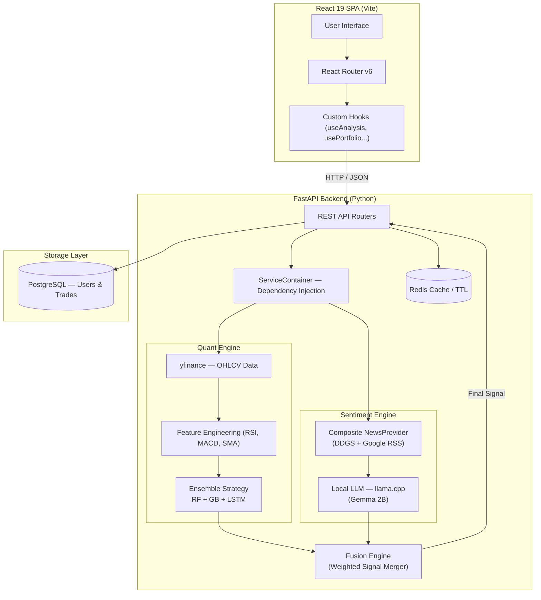
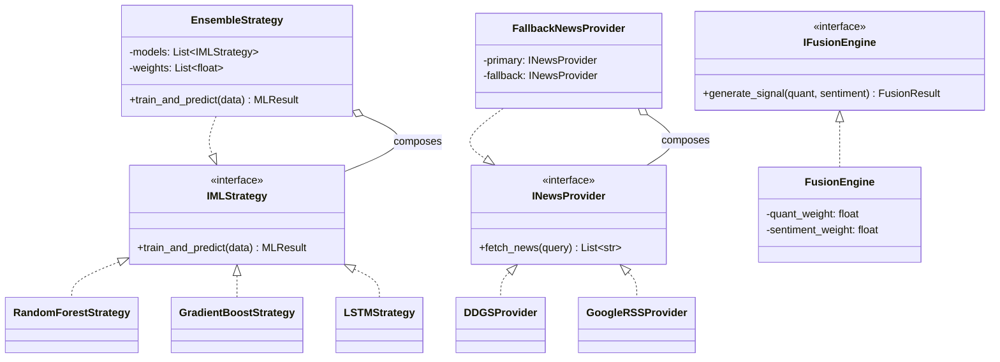
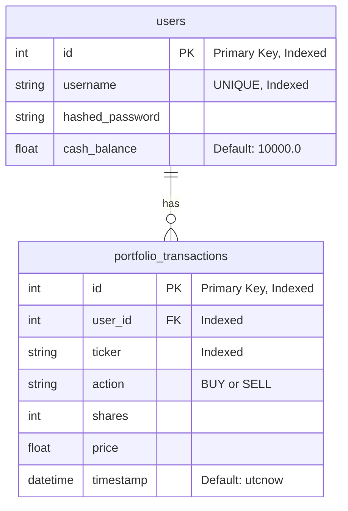

# FinHelp — Intelligent Trading Terminal

<div align="center">


[](https://github.com)
[](https://python.org)
[](https://react.dev)
[](https://fastapi.tiangolo.com)
[](https://postgresql.org)
[](https://docker.com)


**A production-grade, full-stack financial analysis platform that merges Machine Learning ensembles with privacy-first Local LLMs to generate explainable, multi-dimensional trading signals.**

[Features](#-key-features) · [Architecture](#️-system-architecture) · [Quick Start](#-quick-start) · [Tech Stack](#️-tech-stack) · [Directory Structure](#-directory-structure) · [Testing](#-testing) · [Roadmap](#-roadmap)

</div>

---

## 📖 What is FinHelp?

**FinHelp** acts as your personal, automated quantitative analyst. It combines two fundamentally different analytical approaches into a single **Fusion Signal**:

1. **The Math (Quantitative ML Engine)** — A battle-tested ensemble of Random Forest, Gradient Boosting, and LSTM models trained on historical price action, technical indicators (RSI, MACD, Moving Averages), and volume patterns.

2. **The Context (LLM Sentiment Engine)** — A locally running, privacy-first Large Language Model that reads live financial news headlines and scores market psychology from -10 (extreme fear) to +10 (extreme greed).

These two signals are fused together with a probabilistic weighting system to produce a final, actionable verdict: `STRONG BUY`, `BUY`, `HOLD`, `AVOID`, or `STRONG AVOID`.

> *"Markets are 80% psychology, 20% math. FinHelp measures both."*

---

## ✨ Key Features

| Feature | Description | Why We Built It |
| :--- | :--- | :--- |
| 🤖 **ML Ensemble Engine** | Combines Random Forest, Gradient Boosting, and LSTM into a single weighted ensemble | To capture both non-linear market patterns and sequential time-series dependencies that no single model can |
| 🧠 **Local LLM Sentiment** | Scrapes live news and runs it through a local `llama.cpp` Gemma model | Zero data leaks to third-party APIs. Your financial queries stay completely private on your hardware |
| ⚡ **Signal Fusion** | Probabilistically merges ML confidence score with LLM sentiment score | Pure math misses news shocks; pure sentiment ignores technical resistance. The fusion creates a holistic, defensible signal |
| 📈 **Paper Trading Portfolio** | Simulated ledger with live Unrealized PNL, average cost tracking, and transaction history | Test every signal with zero financial risk under real-time market conditions |
| 🔁 **Historical Backtesting** | Vectorized simulation engine over 1–5 years of data | Mathematically proves whether the AI strategy beats a "Buy & Hold" benchmark, with full trade-by-trade CSV export |
| 🕯️ **Candlestick Charting** | Interactive candlestick and volume charts across 6 time periods | Bloomberg-terminal-grade technical analysis visualization |
| 📊 **Watchlist Comparison** | Run the full analysis pipeline on multiple tickers simultaneously | Identify the strongest opportunity across a portfolio with a single click |
| 🔐 **JWT Authentication** | Secure user registration and login, with per-user isolated portfolios | Production-grade auth to ensure every user's trading data is completely private and isolated |

---

## 🏗️ System Architecture

### High-Level Data Flow



---

### OOP & Design Patterns

The backend rigorously follows **SOLID** principles and leverages the **Strategy** and **Composite** design patterns, making every engine independently swappable.



---

### Database Schema (ERD)



---

## 📂 Directory Structure

```text
finhelp/
│
├── backend/
│   ├── src/
│   │   ├── core/                      # Global foundation layer
│   │   │   ├── config.py              # Environment & app settings
│   │   │   ├── database.py            # SQLAlchemy engine & sessions
│   │   │   └── security.py            # JWT creation & verification
│   │   │
│   │   ├── shared/                    # Cross-domain utilities
│   │   │   ├── llm/                   # llama.cpp integration
│   │   │   ├── news/                  # Composite news providers
│   │   │   └── cache.py               # Redis / in-memory TTL caching
│   │   │
│   │   └── domain/                    # Domain-Driven Design modules
│   │       ├── auth/                  # User registration & JWT auth
│   │       │   ├── router.py
│   │       │   ├── schemas.py
│   │       │   └── service.py
│   │       ├── portfolio/             # Paper trading & transactions
│   │       │   ├── router.py
│   │       │   ├── models.py          # SQLAlchemy ORM models
│   │       │   └── service.py
│   │       └── analysis/              # Core ML & LLM engines
│   │           ├── router.py
│   │           ├── strategies/        # IMLStrategy implementations
│   │           │   ├── random_forest.py
│   │           │   ├── gradient_boost.py
│   │           │   ├── lstm.py
│   │           │   └── ensemble.py
│   │           ├── fusion.py          # Fusion Engine
│   │           └── service.py
│   │
│   ├── tests/                         # Pytest backend test suite
│   ├── requirements.txt
│   └── main.py                        # FastAPI composition root
│
├── frontend/
│   ├── src/
│   │   ├── components/                # React UI Component Layer
│   │   │   ├── SingleTicker/          # Single stock analysis view
│   │   │   │   ├── TickerHero.jsx     # Price, signal, & PNL banner
│   │   │   │   ├── MLEngineCard.jsx   # ML stats, chart, features
│   │   │   │   ├── LLMAgentCard.jsx   # Sentiment & news headlines
│   │   │   │   └── index.jsx          # Wrapper & live price logic
│   │   │   ├── Portfolio/             # Portfolio management view
│   │   │   │   ├── PortfolioSummary.jsx
│   │   │   │   ├── EquityCurve.jsx
│   │   │   │   ├── HoldingsTable.jsx
│   │   │   │   ├── TransactionHistory.jsx
│   │   │   │   └── index.jsx
│   │   │   ├── Backtest/              # Historical backtesting view
│   │   │   │   ├── BacktestForm.jsx
│   │   │   │   ├── MetricsCards.jsx
│   │   │   │   ├── BacktestEquityCurve.jsx
│   │   │   │   ├── TradeLog.jsx
│   │   │   │   └── index.jsx
│   │   │   ├── Watchlist/             # Multi-ticker comparison
│   │   │   │   ├── WatchlistTable.jsx
│   │   │   │   ├── WatchlistErrors.jsx
│   │   │   │   └── index.jsx
│   │   │   ├── Charts/                # Candlestick chart view
│   │   │   │   ├── ChartsForm.jsx
│   │   │   │   ├── CandlestickChart.jsx
│   │   │   │   ├── CustomTooltip.jsx
│   │   │   │   └── index.jsx
│   │   │   ├── Header.jsx             # Navigation & search bar
│   │   │   ├── Login.jsx              # Authentication page
│   │   │   ├── Register.jsx
│   │   │   ├── TradeModal.jsx         # Trade execution dialog
│   │   │   ├── QuickTrade.jsx         # Inline trade widget
│   │   │   ├── HistoryPanel.jsx       # Analysis history drawer
│   │   │   └── EmptyState.jsx         # Landing/idle state
│   │   │
│   │   ├── hooks/                     # Reusable custom React hooks
│   │   │   ├── useAnalysis.js         # /api/analyze API hook
│   │   │   ├── usePortfolio.js        # /api/portfolio API hook
│   │   │   ├── useWatchlist.js        # /api/compare API hook
│   │   │   ├── useBacktest.js         # /api/backtest API hook
│   │   │   ├── useCharts.js           # /api/charts API hook
│   │   │   ├── useLivePrice.js        # Polling hook (10s interval)
│   │   │   └── useHistory.js          # LocalStorage history hook
│   │   │
│   │   ├── utils/                     # Pure helper functions
│   │   ├── App.jsx                    # BrowserRouter & routes
│   │   └── index.css                  # Global design system & tokens
│   │
│   └── src/tests/                     # Vitest + Playwright tests
│
├── docker-compose.yml                 # PostgreSQL & Redis containers
├── start.sh                           # One-command dev boot script
├── .gitignore
└── README.md
```

---

## 🚀 Quick Start

### Prerequisites
- [Docker](https://docs.docker.com/get-docker/) and Docker Compose
- [Node.js 18+](https://nodejs.org/) and npm
- Python 3.10+

### Option A — Production (Docker Compose)

```bash
# Clone the repository
git clone https://github.com/Mvdodiya001/finhelp.git
cd finhelp

# Start all services (DB + Redis + Backend + Frontend)
docker compose up -d --build
```

| Service | URL |
| :--- | :--- |
| Frontend App | http://localhost |
| Backend API Docs | http://localhost:8000/docs |

---

### Option B — Local Development

**Step 1: Start Infrastructure**
```bash
docker compose up -d db redis
```

**Step 2: Start Backend**
```bash
cd backend
python3 -m venv venv && source venv/bin/activate
pip install -r requirements.txt

export USE_REDIS=true
uvicorn main:app --host 0.0.0.0 --port 8000 --reload
```

**Step 3: Start Frontend**
```bash
cd frontend
npm install
npm run dev
```

**Step 4 (Optional): Enable Local LLM**

Download a quantized GGUF model (e.g., Gemma 2B) and set the path in `backend/.env`:
```bash
LLM_MODEL_PATH=/path/to/your/model.gguf
```

---

## 🛠️ Tech Stack

### Backend

| Technology | Role |
| :--- | :--- |
| **Python 3.10+ / FastAPI** | High-performance async API framework with auto-generated OpenAPI docs |
| **SQLAlchemy + PostgreSQL** | ACID-compliant ORM for user and transaction management |
| **Scikit-Learn** | Random Forest, Gradient Boosting, and feature engineering pipelines |
| **PyTorch** | LSTM sequential time-series model |
| **llama-cpp-python** | CPU-based local LLM inference (Gemma 2B, quantized GGUF) |
| **yfinance** | Yahoo Finance data pipeline for OHLCV historical & live price data |
| **Redis / In-Memory Cache** | TTL-based response caching for expensive ML inference |
| **JWT (python-jose)** | Stateless authentication with Bearer token flow |

### Frontend

| Technology | Role |
| :--- | :--- |
| **React 19 + Vite** | Component-based SPA with sub-100ms HMR |
| **React Router v6** | Client-side routing (`/analyze`, `/portfolio`, `/backtest`...) |
| **Recharts** | Custom candlestick, volume, and equity curve charts |
| **Lucide React** | Consistent, lightweight icon system |
| **Vanilla CSS** | Full-control design system with CSS tokens and Glassmorphism |

### DevOps

| Technology | Role |
| :--- | :--- |
| **Docker + Docker Compose** | Container orchestration for reproducible environments |
| **Vitest + RTL** | Component-level unit and integration tests |
| **Playwright** | End-to-end browser automation tests |

---

## 🧠 Core Logic Deep Dive

### 1. Feature Engineering Pipeline
Raw OHLCV data from `yfinance` is passed through a feature engineering pipeline that computes:
- **SMA 20/50** — Short and medium-term trend direction
- **RSI (14-day)** — Identifies overbought/oversold conditions
- **MACD** — Momentum oscillator for trend reversals
- **Volume Ratio** — Detects abnormal buying/selling pressure

### 2. ML Ensemble Strategy
Three models vote on the probability that the next trading session will close **higher**:
- `RandomForestStrategy` → Feature importance-based non-linear classifier
- `GradientBoostStrategy` → Sequential error-correction ensemble
- `LSTMStrategy` → Recurrent network capturing temporal order dependencies

Their predictions are combined using **learned weights** from cross-validation accuracy, and a final 95% confidence interval is computed.

### 3. LLM Sentiment Analysis
A composite news provider (DDGS primary, Google RSS fallback) fetches the 10 most recent headlines for the given ticker. These are fed into the local `llama.cpp` model with a structured prompt that forces a JSON response: `{"score": -5, "summary": "...", "headlines": [...]}`.

### 4. Fusion Engine
The final signal score is computed as:
```
final_score = (ML probability_up × quant_weight) + (LLM normalized_score × sentiment_weight)
```
The weights (`quant_weight` + `sentiment_weight` = 1.0) are configurable. The final score maps to a signal bucket: `STRONG AVOID (<0.3)`, `AVOID (0.3–0.45)`, `HOLD (0.45–0.55)`, `BUY (0.55–0.7)`, `STRONG BUY (>0.7)`.

---

## 🧪 Testing

```bash
# Backend — Pytest unit tests (ML models, API endpoints, caching)
cd backend && pytest tests/ -v

# Frontend — Vitest + React Testing Library
cd frontend && npm run test

# End-to-End — Playwright (real browser automation)
./e2e_test.sh
```

---

<div align="center">

Built as a comprehensive demonstration of Machine Learning, Full-Stack Development, and Production DevOps.

**[⬆ Back to Top](#finhelp--intelligent-trading-terminal)**

</div>
